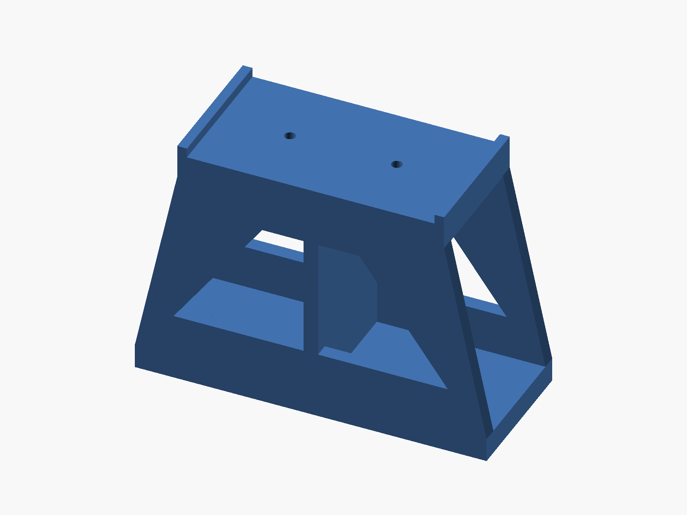
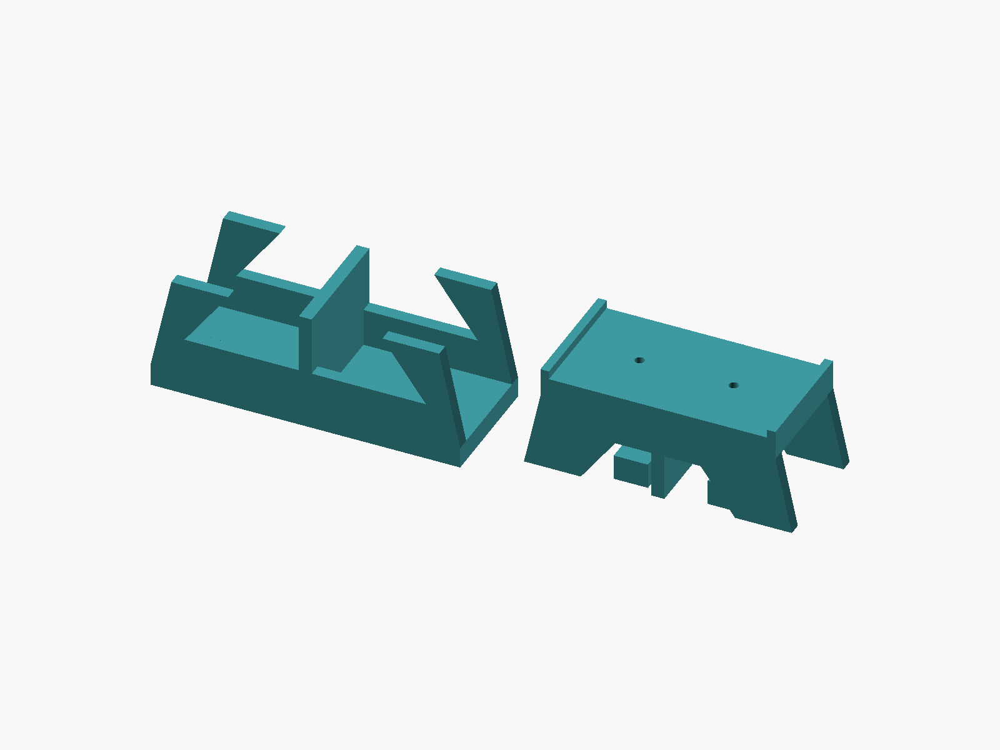
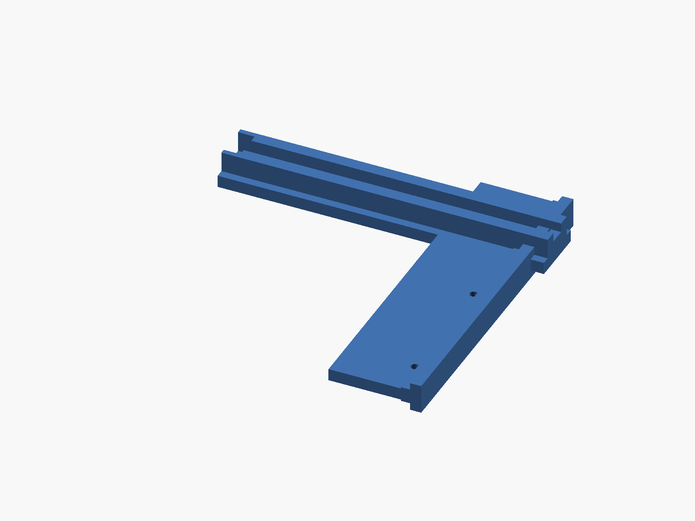

# Desk Shelf Holder

This workspace contains one OpenSCAD model for a desk-shelf holder sized for a 1200 x 200 x 18 mm board.

- File: `desk_shelf_holder.scad`
- The holder can be exported as a split base and cap to reduce print risk
- Print two bases and two caps, then glue each base/cap pair together
- Target board top height: 120 mm
- Shelf underside height: 102 mm
- Approximate base print envelope: 145 x 58 x 56 mm
- Approximate cap print envelope: 145 x 58 x 62 mm

Notes:

- The model is intentionally symmetric front-to-back so the same print works on both sides without mirroring.
- The board rests on a 110 mm deep top platform, centered on a 145 mm base for front/back stability.
- The default printable model includes two screw pass-through holes per holder for fastening the wooden board.
- The split joint uses interlocking blocks sized for glue assembly rather than bolts.
- Set `add_screw_holes = false;` if you want a version without screw holes.
- `render_part = "base";` exports the lower part.
- `render_part = "cap";` exports the upper part.
- `show_preview = true;` renders the full shelf with both split holders assembled.

## Drawer Side Slide

This workspace also contains a two-piece drawer slide sized for a 220 x 150 x 70 mm wooden box.

- File: `drawer_side_slide.scad`
- Print two table rails and two box runners
- Shelf depth: 200 mm
- Wooden box size: 220 x 150 x 70 mm
- Slide length: 160 mm
- Approximate table rail print envelope: 160 x 28 x 16 mm
- Approximate box runner print envelope: 160 x 36 x 15 mm
- Both parts include 3 mounting holes by default

Notes:

- The table rail screws to the underside of the shelf.
- The box runner screws to each side of the wooden box.
- The mounting holes are positioned at 18 mm, 80 mm, and 142 mm from the rail front.
- The runner head slides inside the table rail T-slot.
- The slide is 160 mm long even though the box depth is 150 mm.
- The rail includes a stronger front detent so the drawer resists sliding fully out by accident.
- The default fit is intentionally a bit loose for easier printing and smoother motion.
- `show_preview = true;` renders the shelf, box, both table rails, and both box runners.
